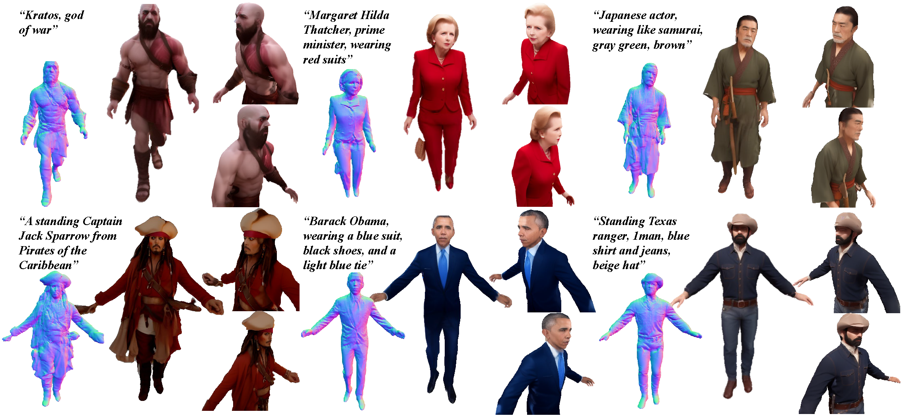

# MVHuman: Tailoring 2D Diffusion with Multi-view Sampling For Realistic 3D Human Generation
PyTorch implementation of paper "MVHuman: Tailoring 2D Diffusion with Multi-view Sampling For Realistic 3D Human Generation", arXiv 2024.

> MVHuman: Tailoring 2D Diffusion with Multi-view Sampling For Realistic 3D Human Generation   
> [Suyi Jiang](https://suezjiang.github.io/), [Haimin Luo](https://haiminluo.github.io/), 
>Haoran Jiang, Ziyu Wang, [Jingyi Yu](http://www.yu-jingyi.com/),
>[Lan Xu](https://www.xu-lan.com/index.html)

#### [project page](https://suezjiang.github.io/mvhuman/) | [paper](https://arxiv.org/abs/2312.10120)



# Installation

```bash
git clone git@github.com:SuezJiang/MVHuman.git
cd MVHuman
conda create -n mvhuman python==3.8.16
conda activate mvhuman
conda install pytorch==1.13.1 torchvision==0.14.1 torchaudio==0.13.1 pytorch-cuda=11.7 -c pytorch -c nvidia
pip install -r requirements.txt
```
Tested on Ubuntu with RTX 3090.


# Data
There are two example data in [`data`](data), [`data/4_views`](data/4_views) is a simplified scene of 4 fullbody views, [`data/16_views`](data/16_views) is a complete scene of 8 fullbody and 8 upperbody views.

## Get Started
You can paste your Hugging Face token in [`TOKEN`](TOKEN).
You can set the diffuser cache directory in [`config/config.py`](config/config.py) (change the `cache_dir`).

### Generation
For the **16_views** case,
```bash
$ python pipeline_multiview.py config=./config/deg_45_16view.yaml
```

For the **4_views** case,
```bash
$ python pipeline_multiview.py config=./config/deg_90s_4view.yaml
```
Results will be written to [`{case_dir}/results`]({case_dir}/results).


### Extention to new dataset

We follow similar data structure with [nerfstudio](https://github.com/nerfstudio-project/nerfstudio/?tab=readme-ov-file).

## Citation
```
@article{jiang2024mvhuman,
    title={MVHuman: Tailoring 2D Diffusion with Multi-view Sampling For Realistic 3D Human Generation},
    author={Suyi, Jiang and Haimin, Luo and Haoran, Jiang and Ziyu, Wang and Jingyi, Yu and Lan, Xu},
    journal={arXiv preprint},
    year={2024}
    }
```